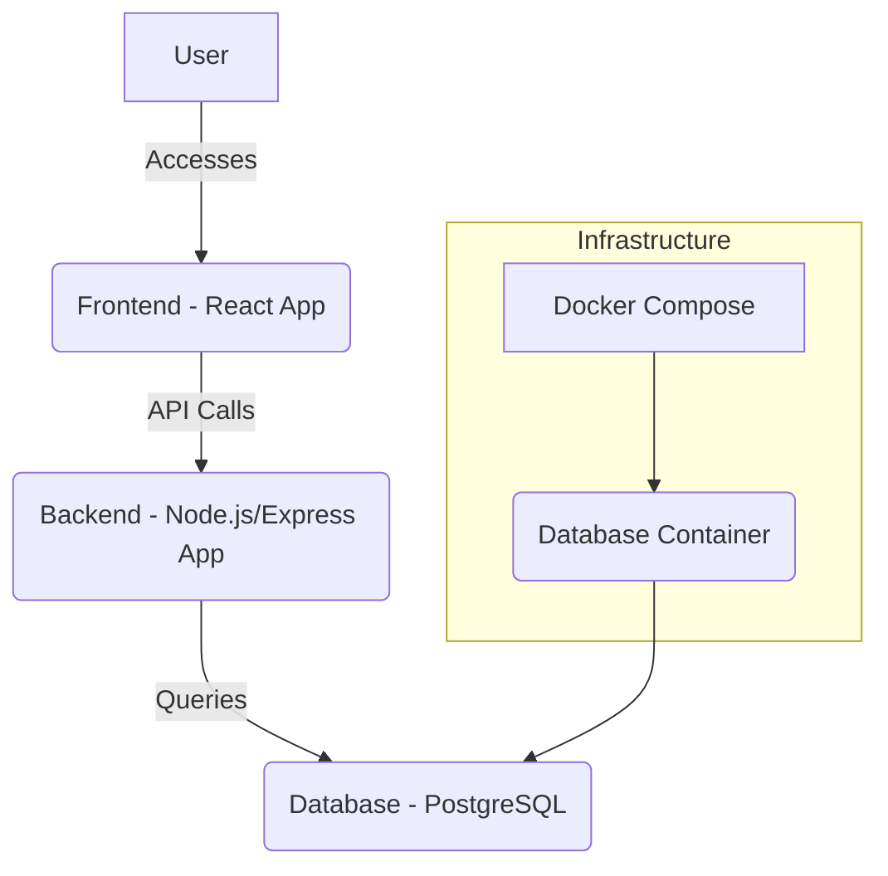
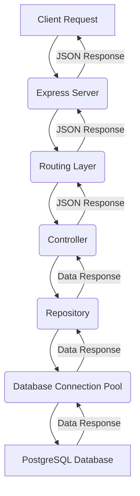

# Fullstack Log App

**Lint:** 

**Backend Build:** 

**Frontend Build:** 

This is a full-stack application for logging.

## High Level Architecture

```mermaid
graph TD
    A[User] -->|Accesses| B(Frontend - React App)
    B -->|API Calls| C(Backend - Node.js/Express App)
    C -->|Queries| D(Database - PostgreSQL)

    subgraph Infrastructure
        E[Docker Compose] --> H(Database Container)
    end

    H --> D
```

## Backend Data Flow

```mermaid
graph TD
    A[Client Request] --> B(Express Server)
    B --> C(Routing Layer)
    C --> D(Controller)
    D --> E(Repository)
    E --> F(Database Connection Pool)
    F --> G[PostgreSQL Database]

    G -->|Data Response| F
    F -->|Data Response| E
    E -->|Data Response| D
    D -->|JSON Response| C
    C -->|JSON Response| B
    B -->|JSON Response| A
```