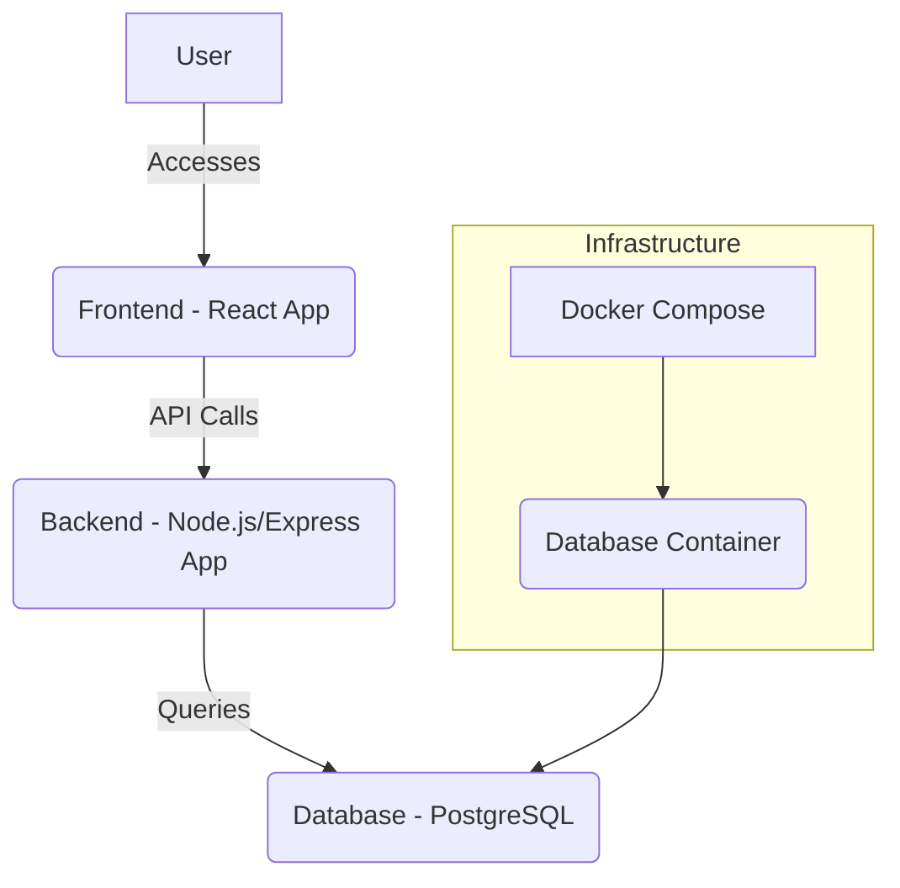
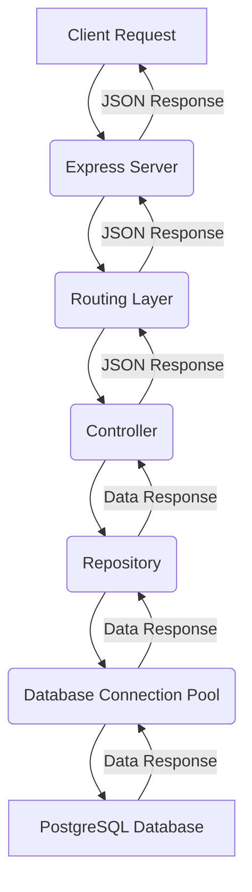

# Fullstack Log App

**Lint:** [](https://github.com/vineethvijayan314/fullstack-log-app/actions/workflows/ci.yml)

**Backend Build:** [](https://github.com/vineethvijayan314/fullstack-log-app/actions/workflows/ci.yml)

**Frontend Build:** [](https://github.com/vineethvijayan314/fullstack-log-app/actions/workflows/ci.yml)


## Prerequisites

To run this project, you need to have the following installed on your machine:

*   **Docker**: For running the PostgreSQL database.
*   **Docker Compose**: For defining and running the database service.
*   **Node.js** (with npm): For running the backend and frontend applications.

## Getting Started

Follow these steps to get the project up and running on your local machine:

1.  **Clone the repository:**

    ```bash
    git clone https://github.com/vineethvijayan314/fullstack-log-app.git
    cd fullstack-log-app
    ```

2.  **Install Dependencies:**

    We have a monorepo setup, so dependencies are managed at the root level. Run the following command to install all dependencies:

    ```bash
    npm install
    ```

3.  **Start the database:**

    This command will build the Docker image for the database (if not already built) and start the PostgreSQL service.

    ```bash
    docker-compose up --build -d db
    ```

4.  **Start the backend server:**

    ```bash
    npm run start:backend
    ```

    The backend API should now be accessible at `http://localhost:4000`.

5.  **Start the frontend development server:**

    Open a new terminal window, navigate to the project root, and then:

    ```bash
    npm run start:frontend
    ```

    The frontend application should now be accessible at `http://localhost:5173`.

6.  **Access the application:**

    Open your web browser and navigate to the frontend URL (e.g., `http://localhost:5173`).

7.  **Unit Testin:**

    We have tests for backend application. You can run them using the following command:

    ```bash
    npm run test:backend
    ```

    This will execute the backend tests and display the results in the terminal.


## High Level Architecture



## Backend Data Flow


