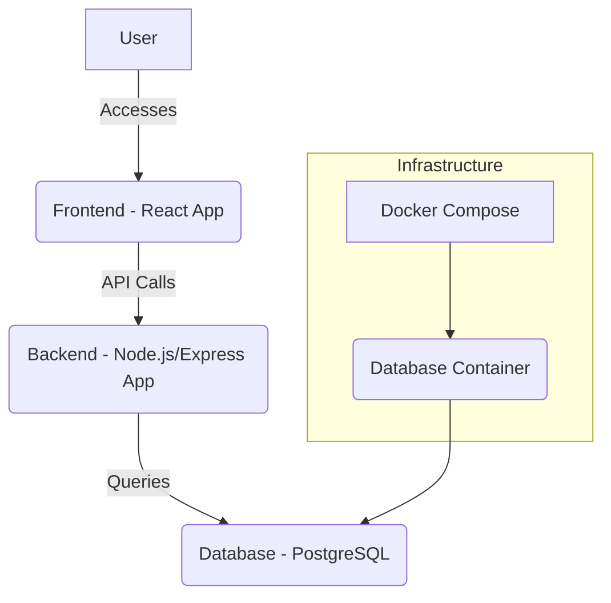
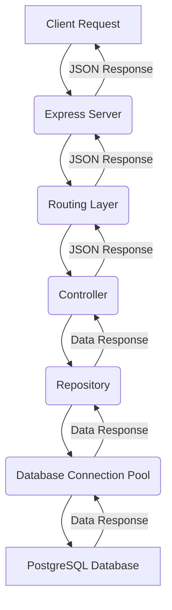

# Fullstack Log App

**Lint:** [](https://github.com/vineethvijayan314/fullstack-log-app/actions/workflows/ci.yml)

**Backend Build:** [](https://github.com/vineethvijayan314/fullstack-log-app/actions/workflows/ci.yml)

**Frontend Build:** [](https://github.com/vineethvijayan314/fullstack-log-app/actions/workflows/ci.yml)

This is a full-stack application for logging.


## Prerequisites

To run this project, you need to have the following installed on your machine:

*   **Docker**: For running the PostgreSQL database.
*   **Docker Compose**: For defining and running the database service.
*   **Node.js** (with npm): For running the backend and frontend applications.

## Getting Started

Follow these steps to get the project up and running on your local machine:

1.  **Clone the repository:**

    ```bash
    git clone https://github.com/vineethvijayan314/fullstack-log-app.git
    cd fullstack-log-app
    ```

2.  **Install Dependencies:**

    We have a monorepo setup, so dependencies are managed at the root level. Run the following command to install all dependencies:

    ```bash
    npm install
    ```

3.  **Start the database:**

    This command will build the Docker image for the database (if not already built) and start the PostgreSQL service.

    `db/init.sql` file will be executed to initialize the database.

    ```bash
    docker-compose up -d
    ```

4.  **Start the backend server:**

    ```bash
    npm run start:backend
    ```

    The backend API should now be accessible at `http://localhost:4000`.

5.  **Start the frontend development server:**

    Open a new terminal window, navigate to the project root, and then:

    ```bash
    npm run start:frontend
    ```

    The frontend application should now be accessible at `http://localhost:5173`.

6.  **Access the application:**

    Open your web browser and navigate to the frontend URL (e.g., `http://localhost:5173`).

7.  **Unit Testin:**

    We have tests for backend application. You can run them using the following command:

    ```bash
    npm run test:backend
    ```

    This will execute the backend tests and display the results in the terminal.


## High Level Architecture



## Backend Data Flow



## Code Quality and Git Hooks (Husky)

This project utilizes [Husky](https://typicode.github.io/husky/) to manage Git hooks, ensuring code quality and consistency across the development team. Specifically, a `pre-push` hook is configured to automate checks before code is pushed to the remote repository.

### `pre-push` Hook Workflow

Before you can push your changes, the `pre-push` hook automatically performs the following:

1.  **Branch Protection**: Prevents direct pushes to the `main` branch, enforcing a pull request workflow.
2.  **Branch Synchronization**: Checks if your current branch is behind `origin/main`. If it is, you will be prompted to pull or rebase from `main` to ensure your branch is up-to-date, preventing merge conflicts and ensuring you're working with the latest code.
3.  **Automated Testing**: Runs unit tests for the backend application (`npm run test --workspace=backend`) to catch regressions early.
4.  **Code Linting**: Executes lint checks for both the backend (`npm run lint --workspace=backend`) and frontend (`npm run lint --workspace=react`) to enforce coding standards and identify potential issues.

These automated checks help maintain a high standard of code quality and ensure that only well-tested and properly formatted code is integrated into the main codebase.